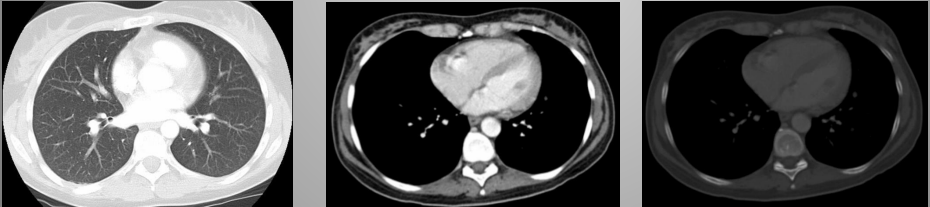
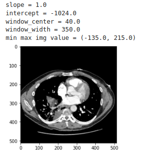
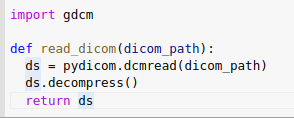
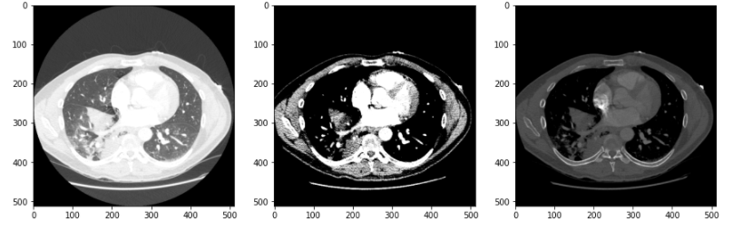
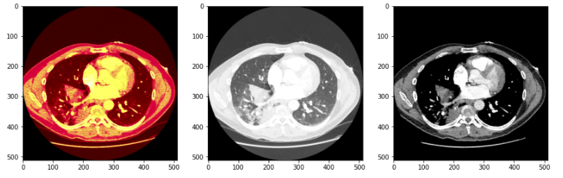
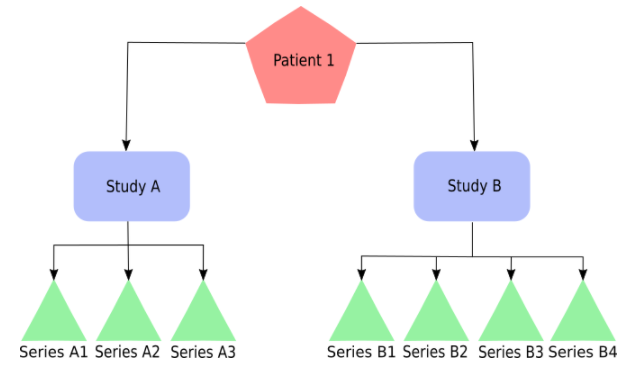

# Introduction to Medical Imaging: Handling Dicom Files

Mostraremos algumas dicas e truques básicos e essenciais ao manusear um arquivo dicom.

O Dicom é um formato de arquivo utilizado para armazenar exames médicos, como radiografias, tomografias, ressonâncias magnéticas, entre outros. Ele armazena vários metadados sobre o exame, como dados do paciente, a máquina usada para o exame, como a imagem é armazenada, informações espaciais e assim por diante. Cada exame tem propriedades diferentes, por isso é importante saber com qual tipo de exame você estará lidando em um projeto.

# Escala Hounsfield Unit (HU)

Uma imagem dicom de um exame de TC ou raio-X são todas representadas na escala da Unidade Hounsfield, que indica a densidade de cada região do corpo.Uma janela dicom indica qual faixa do espectro de imagem HU original queremos focar. Uma janela é definida pelos parâmetros principais:

Centro da Janela ( wc ): representa a faixa média de HU a focar; Largura da janela ( ww ): indica a faixa de HU a partir do centro da janela a ser analisada

# Building a Compact Windowing Function

Podemos construir uma função compacta capaz de realizar uma operação de janelas sobre uma imagem dicom.Existem vários algoritmos de compactação usados para arquivos dicom. Para disponibilizar o número máximo de algoritmos de descompressão, recomendamos instalar a biblioteca gdcm (use a versão conda desta biblioteca, pois é mais fácil fazê-la funcionar com a biblioteca pydicom). Se estiver instalado, a função de descompressão funcionará com uma gama mais ampla de algoritmos de descompressão. Usar isso pode salvar seu futuro aprendizado profundo para o pipeline de inferência de imagens médicas.

# Testing Other Window Parameters

Usamos a tag dicom PhotometricInterpretation, que mostra se os valores altos de pixel são convertidos em preto (MONOCHROME1) ou branco (MONOCHROME2). Com essa função construída, podemos usá-la para testar diferentes parâmetros de janela. Cada parâmetro de janela é usado para focar a atenção em detalhes específicos da imagem dicom. Por exemplo, o par (centro da janela, largura da janela) usado para analisar os pulmões é (-600, 1500), enquanto uma janela específica do fígado é dada por (30, 150) e uma janela do osso da coluna é (400, 1800)

# Conjunto de Dados

O conjunto de dados está disponível na plataforma kaggle(https://www.kaggle.com/c/rsna-str-pulmonary-embolism-detection/data).

# Handling Series

Neste projeto, vamos nos concentrar em entender como lidar com séries dicom e a hierarquia de certas tags dicom.

Alguns desses arquivos dicom fazem parte de uma mesma série e, quando reunidos, formam uma imagem tridimensional de um paciente. Eles são chamados de Séries Dicom, e a série à qual um arquivo dicom específico pertence pode ser encontrada na tag dicom SeriesInstanceUID.Existe uma hierarquia de fatias, séries e estudos.

# Principais campos:

* SOPInstanceUID: Um identificador único associado a cada arquivo dicom (slice);
* SeriesInstanceUID: Um identificador exclusivo associado a cada série dicom. Várias fatias dicom podem ser associadas ao mesmo  SeriesInstanceUID (somente se a série tiver várias fatias). Em alguns casos (raios-x, por exemplo), cada série possui um único corte;
* SeriesDescription: A descrição do que uma determinada série representa;
* StudyInstanceUID: Um identificador exclusivo associado a cada estudo. Um estudo representa uma coleção de séries obtidas durante uma sessão de exame. Essa hierarquia é apresentada na figura abaixo, onde podemos ver que cada estudo pode ter uma ou mais séries, e cada paciente pode ter um ou mais estudos;
* InstanceNumber: Um número de identificação que indica uma fatia na série. Este atributo indica uma ordem das fatias, e veremos um pouco mais disso nas células a seguir;
* AccessionNumber: Semelhante ao id do estudo: representa um identificador exclusivo do estudo;
* PatientID: identificador único associado a cada paciente;
* ImagePositionPatient: Uma tupla de 3 que indica a posição do canto superior esquerdo no espaço tridimensional. A 3-tupla representa as posições nos eixos X, Y e Z.

# Conjunto de Dados

O conjunto de dados está disponível na plataforma kaggle(https://www.kaggle.com/c/rsna-str-pulmonary-embolism-detection/data).

# Voxel Volume

Este notebook mostrará como calcular a área de cada pixel em uma imagem dicom, bem como calcular o volume de cada voxel em uma série dicom.
Para este notebook, usaremos uma única tomografia computadorizada extraída do conjunto de dados OSIC Pulmonary Fibrosis Progression (https://www.kaggle.com/c/osic-pulmonary-fibrosis-progression/data).
